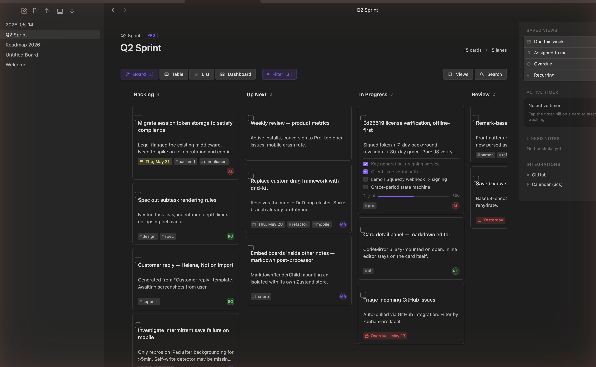
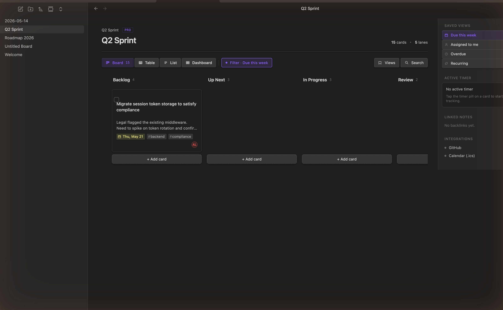
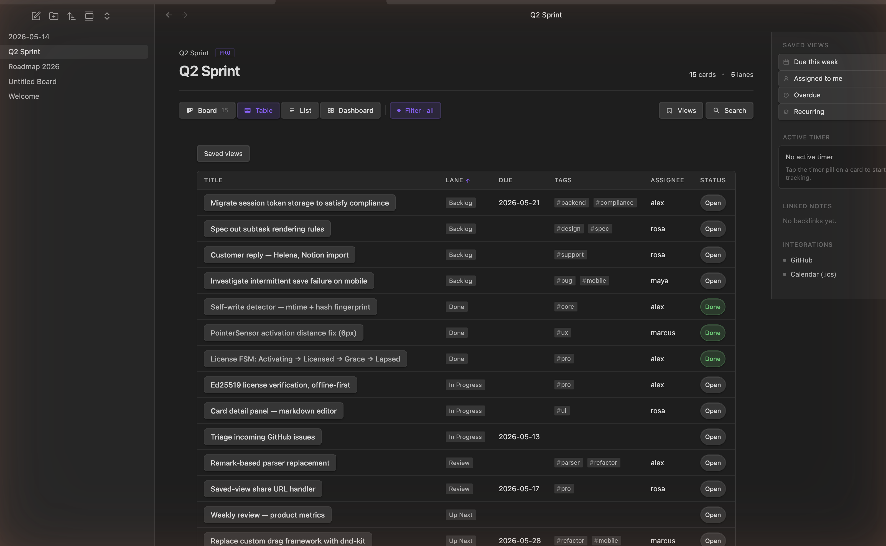
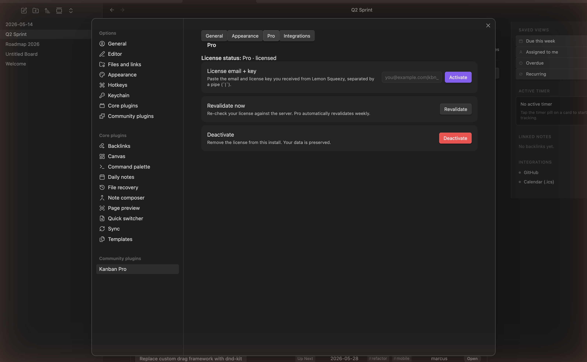
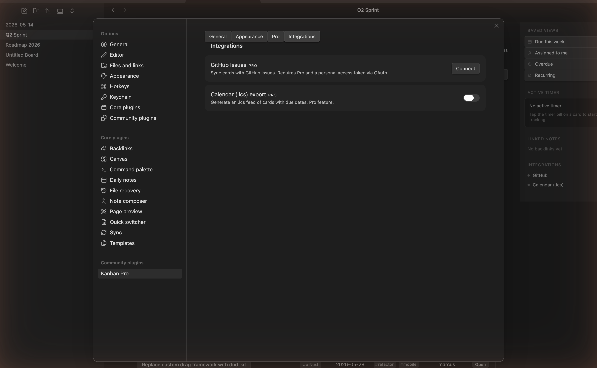

# Kanban for Professionals

Local-first Kanban / project-management boards for [Obsidian](https://obsidian.md). Plan work on a drag-and-drop board, then slice the same cards as a table, a list, or a dashboard — all stored as plain markdown in your vault.

> **Compatible with your existing boards.** Kanban for Professionals reads and writes the same `kanban-plugin: board` markdown format used by the community [Kanban plugin](https://github.com/mgmeyers/obsidian-kanban), so your current boards open without conversion or data loss. (This is an independent project, not affiliated with or endorsed by that plugin or its authors.)

---

## Features

**Free**

- **Board, Table, and List views** of the same cards — switch with one click, no duplication.
- **Drag-and-drop** cards between lanes, with gesture-scoped **undo / redo**.
- **Inline editing** on the card, plus a **detail panel** for the full card.
- **Embed boards** inside other notes with a `kanban-plugin` code block.
- **Inline metadata** — due dates, tags, priorities, and Dataview fields are parsed into chips ([syntax below](#working-with-cards)).
- **Board validator** that round-trips your file and reports any byte-level diff, so you can trust the format is preserved.

**Pro** — _$5.99, lifetime ([details](#pro-features--pricing))_

- **Saved Views** — named, reusable filters (Due this week, Assigned to me, Overdue, Recurring, and your own).
- **Dashboard** — overdue / due-soon counters and rollups across the board.
- **Recurrence** — repeating cards via `[rrule:: …]`, natural-language `[repeats:: …]`, or the 🔁 emoji.
- **Time tracking** — a per-card timer with an active-timer pill in the right rail.
- **Calendar (.ics) export** and **GitHub Issues** sync.

| Saved Views & right rail | Table view |
|---|---|
|  |  |

---

## Installation

### From Obsidian (recommended)

1. Open **Settings → Community plugins** and make sure *Restricted mode* is **off**.
2. Click **Browse**, search for **Kanban for Professionals**.
3. Click **Install**, then **Enable**.

### Manual install

1. Download `manifest.json`, `main.js`, and `styles.css` from the [latest release](https://github.com/icarian-systems/kanban-pro-plugin/releases/latest).
2. Copy them into `<your-vault>/.obsidian/plugins/kanban-pro-boards/`.
3. Reload Obsidian, then enable the plugin under **Settings → Community plugins**.

> Want pre-release builds? Install via [BRAT](https://github.com/TfTHacker/obsidian42-brat) and point it at `icarian-systems/kanban-pro-plugin`.

---

## Getting started

1. **Create a board.** Click the Kanban ribbon icon in the left sidebar, or run **Kanban for Professionals: Create new board** from the command palette (`Cmd/Ctrl+P`). Obsidian opens a new note with three empty lanes.
2. **Add cards.** Click **+ Add card** at the bottom of a lane and start typing. Press `Enter` to save.
3. **Move cards.** Drag a card between lanes. Changes write straight back to the markdown file.
4. **Edit a card.** Click the card title to edit in place, or open the **detail panel** for description, subtasks, due date, and tags.
5. **Switch views.** Use the **Board / Table / List / Dashboard** tabs at the top to see the same cards a different way.

A guided walkthrough is always available via **Kanban for Professionals: Show getting started**.

### Opening an existing board

Any note whose frontmatter contains `kanban-plugin: board` opens as a board automatically — including boards made with the original Kanban plugin. Nothing to convert.

### On mobile

The board works on Obsidian for iOS and Android:

- **Press and hold** a card briefly to pick it up and drag it.
- **Long-press** a card to open its detail panel.

---

## Working with cards

Type these tokens directly into a card's text and Kanban for Professionals renders them as chips. The raw tokens stay in your markdown, so other plugins (Dataview, Tasks) keep working too.

| You want… | Type this | Example |
|---|---|---|
| A due date (Kanban native) | `@{YYYY-MM-DD}` | `@{2026-06-21}` |
| A time of day | `@@{HH:mm}` | `@@{09:30}` |
| A due date (Tasks emoji) | `📅 YYYY-MM-DD` | `📅 2026-06-21` |
| A due date (Dataview) | `[due:: YYYY-MM-DD]` | `[due:: 2026-06-21]` |
| A tag | `#tag` | `#backend` `#client/acme` |
| An assignee / any field | `[key:: value]` | `[assignee:: rosa]` |
| A priority | `🔺 ⏫ 🔼 🔽 🔻` | `Ship release ⏫` |
| A repeating card (RFC 5545) | `[rrule:: …]` | `[rrule:: FREQ=WEEKLY;BYDAY=MO]` |
| A repeating card (plain English) | `[repeats:: …]` | `[repeats:: every monday at 9am]` |
| A block reference | `^id` (line end) | `^card-42` |

Kanban for Professionals also recognizes the broader [Tasks plugin](https://publish.obsidian.md/tasks/) emoji set (⏳ scheduled, 🛫 start, ✅ done, ❌ cancelled, ➕ created, 🆔 id, 🏁 on-completion). The full grammar lives in [`docs/inline-meta.ebnf`](docs/inline-meta.ebnf).

---

## Views

- **Board** — the classic Kanban columns; drag cards between lanes.
- **Table** — a sortable grid (title, lane, due, tags, assignee, status). Good for scanning a lot of cards at once.
- **List** — a compact, linear read of every card.
- **Dashboard** _(Pro)_ — overdue / due-soon counters and cross-lane rollups.

The **right rail** holds Saved Views, the active timer, linked notes, and integrations. Use the **Filter** and **Search** controls in the toolbar to narrow any view.

---

## Commands

Open the command palette with `Cmd/Ctrl+P`; every entry is prefixed **Kanban for Professionals:**. None ship with a default hotkey — assign your own under **Settings → Hotkeys**.

| Command | What it does |
|---|---|
| **Create new board** | Create a new board, or open an existing one. |
| **Cycle view mode (Board / Table / List)** | Rotate the active board through the three views. |
| **Open Dashboard** _(Pro)_ | Open the dashboard for the active board. |
| **Insert from template** | Insert cards from a saved template into the active board. |
| **Undo last drag** / **Redo** | Step through the board's gesture-scoped history. |
| **Validate board** | Round-trip the active file through the parser and report any byte diff. |
| **Canonicalize this board** | Rewrite inline tokens into the canonical order (opt-in). |
| **Export board to calendar (.ics)** _(Pro)_ | Write an `.ics` of every dated card next to the board file. |
| **Activate Pro license** | Open the Pro pane (or activate a stored key). |
| **Show getting started** | Reopen the onboarding walkthrough. |
| **Rebuild vault index** | Rebuild the cross-board index used by Saved Views and the dashboard. |

---

## Settings

Open **Settings → Community plugins → Kanban for Professionals** (or the gear on the plugin). The settings are grouped into tabs:

- **General** — board defaults and behavior.
- **Appearance** — view and styling options.
- **Pro** — license status, activation, revalidation, and deactivation.
- **Integrations** — GitHub Issues sync and Calendar (.ics) export _(both Pro)_.

| Pro / license | Integrations |
|---|---|
|  |  |

---

## Pro features & pricing

Kanban for Professionals is **free to install and use** for all free-tier features. Pro unlocks Saved Views, the Dashboard, recurrence, time tracking, and the GitHub / calendar integrations.

**Limited time: $5.99 for lifetime access.** Buy a license from the [Kanban for Professionals checkout](https://icarian-systems.lemonsqueezy.com/checkout/buy/d404fb1f-3961-4a3a-9715-8eb4d784fa5e), then paste your email + key under **Settings → Pro → Activate**.

License verification runs **entirely offline** against bundled public keys; Pro automatically revalidates about once a week. Your boards and data are never gated — deactivating a license preserves everything.

By [Icarian Systems](https://icariansystems.com).

---

## Privacy & network use

Your boards are stored entirely as **local markdown** in your vault. Nothing is uploaded, and the plugin works fully offline. It makes network requests **only** in these cases:

- **Activating / revalidating a license** — exchanging a purchased key for a signed token and periodic revalidation / revocation checks. (Verification itself is offline; the network is only used to obtain and refresh the token.)
- **Optional integrations you turn on** — GitHub Issues sync and calendar export. These are **off by default** and only contact a service after you enable and authenticate them.

No analytics or telemetry are collected. All HTTP goes through Obsidian's `requestUrl` (CORS-safe, mobile-compatible).

---

## Support & feedback

Found a bug or have a request? Open an issue at [icarian-systems/kanban-pro-plugin](https://github.com/icarian-systems/kanban-pro-plugin/issues).

## Contributing

Building from source, the dev watch loop, the test suite, and the project layout are documented in [CONTRIBUTING.md](CONTRIBUTING.md).

## License

MIT. See [`LICENSE`](LICENSE).
